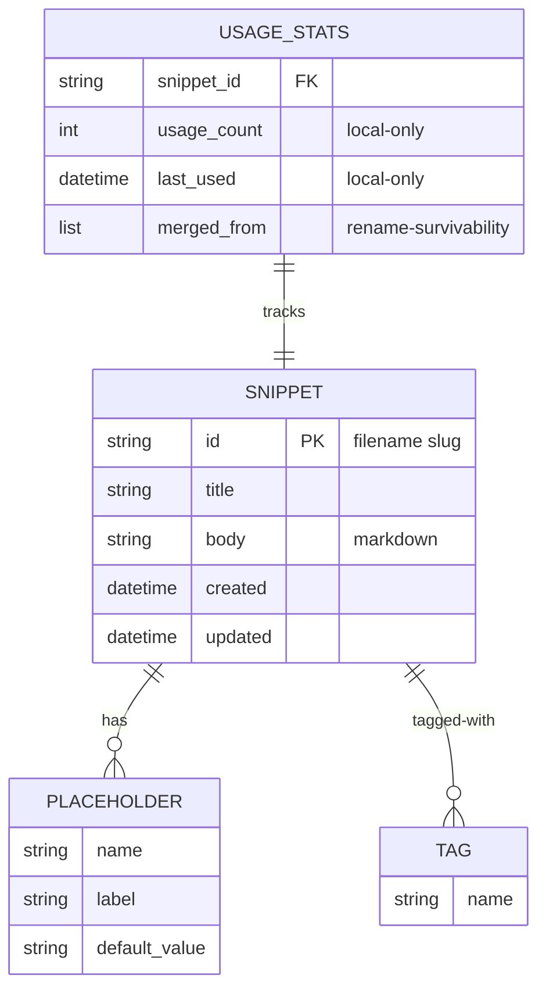

# Snippet Launcher (WPF) — V1

## Overview

Een lokale Windows-applicatie (C# / .NET 10 / WPF) die via een globale hotkey een
fuzzy-search popup opent over een persoonlijke snippet-bibliotheek. De gekozen
snippet wordt naar het klembord gekopieerd; de gebruiker plakt zelf met Ctrl+V in
de actieve applicatie. Snippets worden opgeslagen als Markdown-bestanden met
YAML-frontmatter en gesynchroniseerd via een Git-repository, zodat een tweede
Windows-gebruiker dezelfde bibliotheek kan delen.

V1 levert: hotkey-popup, fuzzy search, klembord-output, placeholder-invul, Git-sync,
gebruiksstatistieken (recent/vaak boven), quick-add vanuit clipboard, en een editor.
**Triggers (system-wide expansion), Mac en mobiel zijn expliciet uit scope.**

## Problem Statement / Motivation

Bestaande tools zoals Espanso, Lintalist, PhraseExpress, Beeftext en Ditto dekken
elk delen van het probleem maar geen enkele combineert: moderne fuzzy-search popup
+ Git-backed sync zonder gedoe + klembord-only + placeholders + Windows-native UI.
De gebruiker wil snippets ontsluiten over applicaties heen (WhatsApp Business, browser,
e-mail, IDE) zonder per-app gedoe en zonder tekenlimiet-beperkingen zoals in WABA.

## Proposed Solution

Eén WPF-applicatie met drie vensters:

1. **SearchPopup** — onzichtbaar tot globale hotkey ingedrukt → bovenop alles, focus,
   typ → fuzzy resultaten → Enter kopieert (en sluit).
2. **Editor** — CRUD van snippets, met placeholder-definitie en tags.
3. **Settings + First-run wizard** — repo-pad, hotkey-bindings, Git-status, Git-auth setup.

Achtergrondservices: hotkey-listener, file-watcher op snippet-map, Git-sync poller,
in-memory index. Stats inline in repository (geen aparte service).

## Technical Approach

### Stack

| Laag | Keuze | Reden |
|---|---|---|
| Runtime | .NET 10 (LTS, nov 2025) | Modern, lange support, goede WPF-ondersteuning |
| UI | WPF + MVVM via CommunityToolkit.Mvvm | Volledige UI-controle, Windows-native, mature |
| Fuzzy search | `FuzzySharp` | Eenvoudig, snel genoeg voor 10k snippets in-memory |
| Git | `LibGit2Sharp` | Geen externe Git-CLI dependency, embedded |
| YAML | `YamlDotNet` | Frontmatter parsen |
| Globale hotkey | `RegisterHotKey` via P/Invoke | Standaardpatroon |
| Single-instance lock | Named `Mutex` + named-pipe IPC | Voorkomt dubbele app, kan args forwarden |
| Logging | `Serilog` → rolling file | Diagnostiek |
| Tests | xUnit + FluentAssertions + NetArchTest | Conventional + arch-rules |

**Bewust geschrapt uit V1:** Markdig (preview-pane), tag-autocomplete-engine, toast-meldingen
bij elke copy, FSW-polling-fallback, Velopack/MSIX-installer + code-signing certificaat.
Distributie V1 = self-contained `dotnet publish` zip.

### Snippet-opslagformaat — bestand per snippet

Eén Markdown-bestand per snippet met YAML-frontmatter. Reden: nette Git-diffs,
handmatige edits mogelijk, geen merge-helse JSON-blob.

```markdown
---
id: faq-pricing-nl
title: FAQ — Prijzen NL
tags: [faq, pricing, waba]
placeholders:
  - name: customer_name
    label: Klantnaam
    default: ""
created: 2026-04-28T10:00:00Z
updated: 2026-04-28T10:00:00Z
---
Hoi {customer_name}, je vindt onze actuele prijzen op https://...
```

`id` = bestandsnaam zonder extensie, slug-gebaseerd, immutable na creatie.

### Repo-layout

```
snippets/
  faq-pricing-nl.md
  url-website-home.md
.gitignore                # negeert .local/
README.md                 # uitleg voor de andere gebruiker
.local/                   # nooit committed
  conflicts/              # backups van automatische conflict-resolutie
```

### Lokaal-alleen (NIET in Git)

```
%APPDATA%/SnippetLauncher/
  settings.json           # repo-pad, hotkey-bindings
  usage.json              # per-snippet usage_count + last_used + merged_from
  log/                    # Serilog output
  push-queue.json         # ge-persiste push-queue voor offline restart
```

`usage.json` schema:
```json
{
  "by_id": {
    "faq-pricing-nl": {
      "usage_count": 12,
      "last_used": "2026-04-28T11:22:33Z",
      "merged_from": ["faq-prijzen-nl"]
    }
  }
}
```

`merged_from` ondersteunt latere rename-as-copy: stats overleven hernoeming.

### Architectuur (componenten)

```
+--------------------+        +-----------------------+
|  SearchPopupView   |<------>| SearchPopupViewModel  |
+--------------------+        +-----------+-----------+
                                          |
                                          v command-bus
+--------------------+        +-----------------------+
|  EditorView        |<------>| EditorViewModel       |
+--------------------+        +-----------+-----------+
                                          |
                  +-----------------------+-----------+
                  |             |             |       |
                  v             v             v       v
           SnippetRepo     SearchSvc     PlaceholderSvc  GitSvc
           (single        (in-memory     (uses          (LibGit2Sharp
            writer,        index)         IClipboard)    op git-worker
            stats inline)                                thread)
                  |
                  v
          File system (snippets/*.md) <---- FileSystemWatcher
                  ^                          (echo-suppression)
                  |
              GitService: pull --rebase, async push-queue
```

### Project structuur

Twee projecten (Core/App split) — gerechtvaardigd door V2 Avalonia-pad. Met **NetArchTest**
in CI: Core mag geen `PresentationFramework`/`PresentationCore` referentie bevatten.

```
SnippetLauncher.sln
  SnippetLauncher.Core/    # domain, services, no WPF
  SnippetLauncher.App/     # WPF views/viewmodels
  SnippetLauncher.Core.Tests/
  SnippetLauncher.App.Tests/   # incl. NetArchTest
```

### DI-seams (vóór Phase 2 introduceren)

Voorkomt WPF-leakage in Core en maakt headless tests mogelijk:

```csharp
// Core/Abstractions/
public interface IClock { DateTimeOffset UtcNow { get; } }
public interface IClipboardService {
    Task<string?> GetTextAsync();
    Task SetTextAsync(string text);
    bool HasText { get; }
}
public interface IDialogService {
    Task<Dictionary<string, string>?> ShowPlaceholderFillAsync(IReadOnlyList<Placeholder> ph);
    Task ShowConflictNotificationAsync(IReadOnlyList<string> backedUpFiles);
}
public interface ICommandBus {
    void Publish<T>(T command) where T : ICommand;
    IDisposable Subscribe<T>(Func<T, Task> handler) where T : ICommand;
}
```

`ICommandBus` koppelt `GlobalHotkeyService` los van VMs (in-proc nu, named-pipe later
voor V2 triggers in een apart proces).

### Snippet-model (C#)

```csharp
public sealed record Snippet(
    string Id,
    string Title,
    IReadOnlyList<string> Tags,
    string Body,
    IReadOnlyList<Placeholder> Placeholders,
    DateTimeOffset Created,
    DateTimeOffset Updated);

public sealed record Placeholder(string Name, string Label, string Default);
```

### Sleutel-services (P0 single-writer + atomic + echo-suppression)

```csharp
// Storage/SnippetRepository.cs
//   - Enige writer naar in-memory dictionary. Alle mutaties via Channel<RepoOp>.
//   - Save() workflow:
//       1. Schrijf naar <id>.md.tmp
//       2. Compute hash van content
//       3. Add (path, hash) aan _expectedWrites set (TTL 2s)
//       4. File.Move(.tmp -> .md, overwrite)
//       5. Update in-memory dictionary
//       6. Increment stats inline; debounced flush naar usage.json (30s OF op exit)
//   - FileSystemWatcher events:
//       1. Debounce 300ms per path
//       2. Compute hash, check tegen _expectedWrites — match? skip (eigen save)
//       3. Else: parse en update in-memory; raise SnippetsChangedExternally
//   - LoadAll() bij startup: alle .md parsen; corrupte bestanden loggen + markeren
//     in `MalformedSnippets`-collectie (zichtbaar in editor met "fix" actie),
//     niet uitsluiten in zoekresultaten als titel parse-baar is.

// Search/SearchService.cs
//   Subscribes op SnippetRepository events. Holds gewogen index.
//   Query(string q, int limit) -> List<ScoredSnippet>
//   Empty query -> recency + frequency only.

// Hotkey/IGlobalHotkeyService (Core) + Win impl in App
//   RegisterHotKey + HwndSource. Thread-affinity assert.
//   Publishes via ICommandBus: OpenSearchCommand, QuickAddCommand.
//   Re-entrancy: als popup al open is, focus en breng naar voren — geen stacking.

// Sync/GitService.cs
//   - Eigen git-worker thread (LibGit2Sharp niet thread-safe per repo-handle).
//   - Alle Core-async paths met ConfigureAwait(false).
//   - PullRebase: pause when EditorViewModel.IsDirty (via observable flag).
//   - Conflict resolutie V1: last-writer-wins + backup.
//       - Op rebase-conflict: kopieer "lokale verliezer" naar
//         .local/conflicts/<id>-<timestamp>.md, accepteer remote, raise
//         IDialogService.ShowConflictNotificationAsync met lijst.
//       - Power-user setting "manual-conflict-mode" voor 3-weg picker (later).
//   - CommitAndPush: atomic stage+commit; push naar async queue.
//   - Push-queue: ge-persiste in push-queue.json zodat offline-restart geen verlies geeft.
//     Max retry 5 met exponential backoff; daarna handmatige "retry now" in tray.

// Placeholders/PlaceholderEngine.cs
//   Token regex: \{([a-z_][a-z0-9_]*)\} ; literal { via {{
//   Built-in: {date}, {time}, {clipboard} (snapshot point: gepakt vóór popup-Enter)
//   Custom: gevraagd via IDialogService.ShowPlaceholderFillAsync
```

### Globale hotkey — implementatie-noten

- Hotkey op **UI-thread** registreren met onzichtbaar `HwndSource` (assert affinity).
- `MOD_NOREPEAT` (0x4000) flag.
- Activatie: `SetForegroundWindow` + ALT-key trick. **Bij Win11 24H2+** fallback op
  `AttachThreadInput`. Niet eindeloos retryen — degrade gracefully.
- `RegisterHotKey == false` → settings-foutmelding + voorgestelde alternatieven.
- **Hotkey wijzigen runtime**: unregister-then-register. Bij faal: rollback naar oude.

**Default bindings:**
- Search popup: `Ctrl+Shift+Space`
- Quick-add van clipboard: `Ctrl+Shift+N`

### Post-Enter volgorde in popup (P0)

```
1. Bepaal resolved string (placeholders ingevuld)
2. Hide popup (visibility Collapsed) + ReleaseCapture
3. Wacht 1 frame (Dispatcher.Yield) — geeft target-window focus terug
4. Clipboard.SetText(resolved)
5. RecordUse(snippet.id)   // stats inline
6. Sluit popup volledig
```

Reden: target-app moet focus terug hebben **vóór** de gebruiker Ctrl+V drukt.
Geen toast — popup-sluiten ís de feedback.

### Quick-add edge cases (P0)

```
HotKey ingedrukt:
  if (clipboard.HasText) -> open editor met body voorgevuld
  else -> open editor met lege body + status "klembord leeg, voer body in"
```

Image/file-clipboard wordt behandeld als "geen tekst" → editor opent leeg.

### Slug-collision

Bij quick-add of nieuwe snippet: slug uit titel. Bestaat al? Probeer `-2`, `-3`, … tot vrij.
Geen prompt, geen reject — gewoon doorlopen.

### Fuzzy search — scoring (ongewijzigd)

```
score(s, q) =
    0.6 * fuzzy(q, s.title)
  + 0.3 * fuzzy(q, join(s.tags))
  + 0.1 * fuzzy(q, s.body[0..500])
  + recencyBoost(s.last_used)         // 0..0.2, exp decay
  + frequencyBoost(s.usage_count)     // 0..0.15, log curve
```

**Geen-resultaten state:** toon "geen match — Enter om snippet aan te maken met titel '<query>'".

### First-run wizard (P0)

Bij eerste start (geen `settings.json`):

```
Stap 1 — Welkom + uitleg
Stap 2 — Repo-pad kiezen:
   • Bestaande lege map → "Init nieuwe repo hier"
   • Bestaande Git-clone → "Gebruik deze repo"
   • Lege/non-existerende → "Maak map + init"
   • Niet-lege niet-Git folder → blokkeren met uitleg
Stap 3 — Remote koppelen (optioneel):
   • "Sla nu over (alleen lokaal)"
   • "URL plakken" → test fetch met Credential-Manager
   • Auth-fouten tonen actionable foutmelding (PAT-link, GCM-install-link)
Stap 4 — Hotkeys bevestigen
Stap 5 — Klaar; popup demo
```

Git for Windows-detectie: zoek `git.exe` in PATH. Niet aanwezig → wizard biedt
download-link en pauzeert tot herstart. (LibGit2Sharp werkt zonder Git-CLI, maar
Credential Manager zit in Git for Windows.)

## Implementation Phases

> Phase 4 (placeholders) is **gemerged in Phase 3** (editor moet placeholders sowieso
> begrijpen). Phase 6 polish is **verspreid** over 2/3/5 — geen aparte polish-fase.

### Phase 1 — Foundation (≈ 3-4 dagen)

- [x] Solution + projects opzetten (Core, App, Core.Tests, App.Tests)
- [x] **NetArchTest** in App.Tests: Core mag geen WPF refs hebben
- [x] DI-abstracties (`IClock`, `IClipboardService`, `IDialogService`, `ICommandBus`)
- [x] `Domain/Snippet.cs`, `Domain/Placeholder.cs`
- [x] `Storage/SnippetRepository.cs` met **single-writer Channel + atomic temp-file write
       + echo-suppression set + inline stats**
- [x] `Search/SearchService.cs` — fuzzy + recency/freq weegfactoren
- [x] Tests: round-trip serialisatie, search ranking, echo-suppression, malformed-YAML

**Acceptance:** 100 snippet-bestanden inladen + query <50ms; eigen save triggert geen reload.

### Phase 2 — Core UI: hotkey + popup + clipboard (≈ 3-5 dagen)

- [x] `IGlobalHotkeyService` (Core interface) + Win impl in App
- [x] In-proc `ICommandBus` implementatie
- [x] `Views/SearchPopupWindow.xaml` (borderless, topmost, acrylic)
- [x] `ViewModels/SearchPopupViewModel.cs` (debounced 150ms, top 8 resultaten)
- [x] Toetsenbord: ↑/↓, Enter, ESC
- [x] **Post-Enter sequence** zoals gespecificeerd (hide → Yield → Clipboard.SetText → close)
- [x] **Hotkey re-entrancy**: tweede press focust bestaande popup
- [x] Tray-icon (`H.NotifyIcon.Wpf`); rechts-klik menu
- [x] Single-instance Mutex + named-pipe IPC voor argument-forward
- [x] Foreground-activation (ALT-key trick + AttachThreadInput fallback)
- [x] Empty-state + no-match-state in popup

**Acceptance:** hotkey opent popup overal; Ctrl+V in target-app plakt direct na popup-close.

### Phase 3 — Editor + CRUD + Placeholders (≈ 5-7 dagen — gemerged)

- [x] `Views/EditorWindow.xaml` (lijst + formulier + placeholder-definities)
- [x] Tags: comma-separated TextBox (geen autocomplete)
- [x] `Placeholders/PlaceholderEngine.cs` (parser + built-ins {date}/{time}/{clipboard})
- [x] `Views/PlaceholderFillDialog.xaml` (dynamisch formulier)
- [x] Integratie in popup-flow (vóór clipboard.SetText)
- [x] **Focus-return na PlaceholderFillDialog**: dialog OK → popup hide-sequence opnieuw
- [x] CRUD via UI; bestanden in repo verschijnen/verdwijnen
- [x] FileSystemWatcher → ViewModel refresh (echo-aware)
- [x] Slug-collision: auto-suffix `-2`, `-3`
- [x] Malformed-snippet UI: "fix"-actie opent raw editor
- [x] Quick-add hotkey + dialog (incl. lege-clipboard pad)

**Acceptance:** snippet met `{naam}` + `{date}` kopieert mét waarden; quick-add saved file in repo.

### Phase 4 — Git sync (≈ 4-6 dagen — grootste risico)

- [x] `Sync/GitService.cs` op **eigen worker-thread**, ConfigureAwait(false) policy
- [x] InitOrOpen, PullRebase, CommitAndPush, Status
- [x] **Auto-pause auto-pull als EditorViewModel.IsDirty**
- [x] **Last-writer-wins conflict-resolutie** + backup naar `.local/conflicts/`
- [x] Tray-status icoon (synced/syncing/behind/conflict)
- [x] Push-queue gepersiste in `push-queue.json` (offline restart-safe)
- [x] Auth via Git Credential Manager (alleen pad — geen PAT-fallback in V1)
- [x] Tests: in-memory repo, simulate conflict, simulate push-fail-then-recover

**Acceptance:** twee machines zien elkaars wijzigingen <60s na save; conflict produceert
backup-bestand + tray-melding; offline restart hervat push-queue.

### Phase 5 — First-run + Settings (≈ 3-4 dagen)

- [x] First-run wizard volgens spec (5 stappen)
- [x] Settings-window: hotkeys (live re-bind met rollback), repo-pad (live switch met
       proper unregister/rebind van watcher + git-handle), pull-interval, theme
- [x] **Repo-pad mid-session wijzigen**: drain push-queue, unbind FSW, reload alles
- [x] Logging via Serilog; crash-handler dialog
- [x] README voor 2e gebruiker

### Phase 6 — Distribution V1 (≈ 1 dag)

- [x] `dotnet publish -c Release --self-contained -r win-x64` → zip
- [x] README met "rechtsklik installer → Eigenschappen → Toestaan" SmartScreen-instructie
- [x] **Geen MSIX, geen code-sign cert, geen auto-updater in V1.**
       Bij meer gebruikers (V1.x) overwegen.

**Totaal: ~3-4 weken parttime** (was 3-5; cuts wegen op tegen toegevoegde robustness).

## Acceptance Criteria

### Functional

- [x] Globale hotkey opent popup binnen <100ms vanaf koud, <30ms warm
- [x] Fuzzy search filtert 1.000 snippets binnen 50ms (debounced 150ms)
- [ ] Lege query toont top 8 op recency + frequency
- [ ] Geen-match toont "Enter om snippet aan te maken"
- [x] Enter: popup hide → frame yield → clipboard set → close — Ctrl+V in target werkt direct
- [ ] Hotkey her-press tijdens open popup focust bestaande popup
- [ ] Editor: aanmaken/bewerken/verwijderen werkt; bestanden in repo
- [ ] Placeholders: `{name}`, `{date}`, `{time}`, `{clipboard}` (snapshot vóór dialog)
- [ ] Literal `{` via `{{` ondersteund
- [ ] Quick-add: tekst-clipboard → editor voorgevuld; non-text → editor leeg met statusmelding
- [ ] Slug-collision auto-suffix
- [ ] Malformed YAML: bestand loggen, "fix"-actie in editor, app start zonder crash
- [ ] Git: pull op start (gepauzeerd als editor dirty), async push, last-writer-wins
       conflict-resolutie met backup + tray-melding, offline-safe push-queue
- [ ] First-run wizard dekt: nieuwe repo, bestaande clone, remote-toevoegen, auth-test
- [ ] Settings: hotkey/repo-pad live wijzigen zonder herstart
- [ ] Tweede gebruiker ziet wijzigingen <60s na save
- [ ] Single-instance: tweede launch met arg forwardt via named pipe (focus + actie)

### Non-Functional

- [ ] Geheugen <150MB met 1.000 snippets
- [ ] Start tot tray-ready <2s
- [ ] Eigen save triggert geen reload (echo-suppression werkt)
- [ ] LibGit2Sharp calls altijd op git-worker thread (assertable in tests)
- [ ] Werkt op Windows 10 22H2 + Windows 11
- [ ] Geen telemetry; alleen Git push/pull naar gebruiker-eigen remote

### Quality Gates

- [x] Test-coverage >70% op `SnippetLauncher.Core` (75,8% line / 61,9% branch)
- [x] **NetArchTest groen**: Core heeft geen WPF-refs
- [x] CI groen (build + tests) — `.github/workflows/ci.yml` aangemaakt
- [x] README + setup-handleiding voor 2e gebruiker

## Success Metrics

- ≥10 snippet-copies/dag binnen 2 weken
- 2e gebruiker zelfstandig live binnen 30 min onboarding
- 0 corruption-incidents in eerste maand
- Mediane popup-latency <50ms

## Risks & Mitigation

| Risico | Kans | Impact | Mitigatie |
|---|---|---|---|
| Hotkey-conflict met andere tools | Mid | Mid | Configureerbaar; foutmelding bij `RegisterHotKey == false` |
| Foreground-activation faalt op Win11 24H2+ | Mid | Hoog | ALT-trick + AttachThreadInput fallback; degrade gracefully |
| Git-conflict bij gelijktijdige edits | Mid | Mid | Last-writer-wins + backup → geen blocked app, geen merge-UI nodig in V1 |
| FSW echo van eigen save reload't editor-buffer | Hoog (zonder mitigatie) | Hoog | Echo-suppression set met (path, hash, TTL) — verplicht in Phase 1 |
| LibGit2Sharp thread-safety | Mid | Hoog | Eigen git-worker thread; alle calls daarbinnen; ConfigureAwait(false) |
| SmartScreen blokkeert ongesigneerde zip | Hoog | Mid | Aanvaard in V1; instructie in README; sign cert in V1.x als nodig |
| Malformed YAML door handmatige edit | Mid | Laag | Per-file isolated parse; "fix"-UI; app blijft functioneel |
| WPF-refs sluipen Core in | Mid | Mid | NetArchTest in CI |

## Future Considerations (V2+)

- **Triggers (system-wide expansion)** — separaat AV-vriendelijk proces, communicatie via
  named-pipe `ICommandBus` (de seam zit er al). Voorbereid: hotkey-pad gaat via command-bus.
- **Mac-port via Avalonia** — Core/App split + DI-seams maken dit grotendeels view-rewrite.
  Risico: LibGit2Sharp ARM64 mac-binary historisch wankel — re-validate of CLI-shellout.
- **iOS read-only viewer** — eigen Markdown-renderer, share-sheet copy.
- **Code-signing + auto-update** — Velopack, MSIX, Sectigo cert (~€200/jr) zodra er
  meer dan 2-3 gebruikers zijn.
- **Tag-autocomplete + Markdown-preview** — toevoegen wanneer eigen gebruik aantoont
  dat het ontbreekt (YAGNI tot dan).
- **Encryptie** — git-crypt of age voor gevoelige snippets.
- **Drie-weg merge UI** — power-user setting bovenop last-writer-wins.

## Documentation Plan

- `README.md` build/run instructies
- `docs/setup-second-user.md` Git install, repo-pad, eerste sync
- `docs/snippet-format.md` Markdown-formaat voor handmatige edits
- Inline first-run wizard

## Data Model (Mermaid)



## References & Research

### Internal
- Brainstorm: [docs/brainstorms/2026-04-28-snippet-launcher-brainstorm.md](../brainstorms/2026-04-28-snippet-launcher-brainstorm.md)

### External
- [LibGit2Sharp](https://github.com/libgit2/libgit2sharp)
- [FuzzySharp](https://github.com/JakeBayer/FuzzySharp)
- [CommunityToolkit.Mvvm](https://learn.microsoft.com/dotnet/communitytoolkit/mvvm/)
- [RegisterHotKey Win32 API](https://learn.microsoft.com/windows/win32/api/winuser/nf-winuser-registerhotkey)
- [NetArchTest](https://github.com/BenMorris/NetArchTest)
- [YamlDotNet](https://github.com/aaubry/YamlDotNet)
- [Espanso (referentie expansion)](https://espanso.org/)
- [Lintalist (referentie bundles)](https://lintalist.github.io/)
