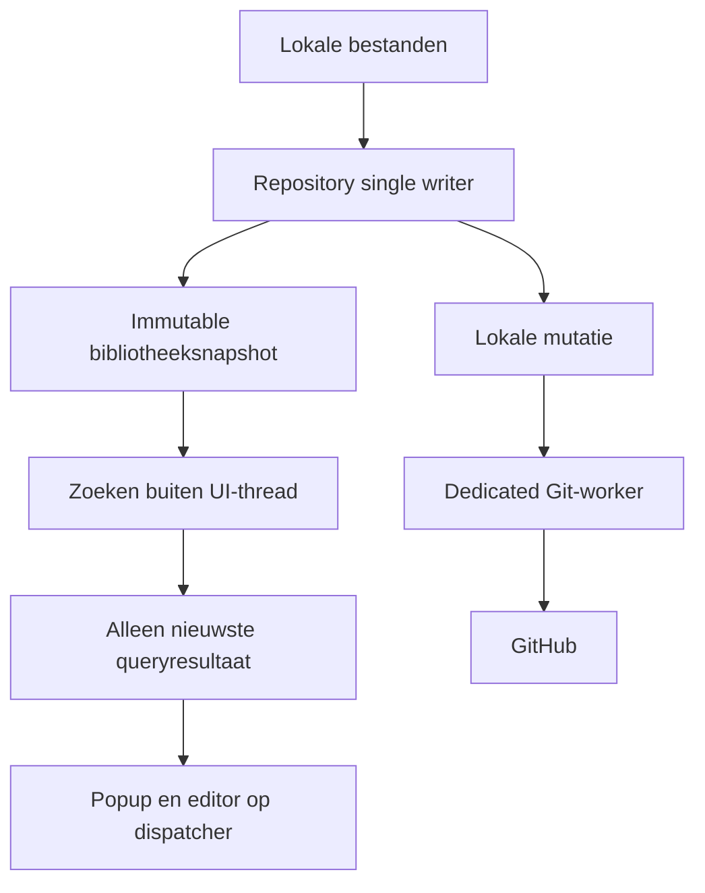
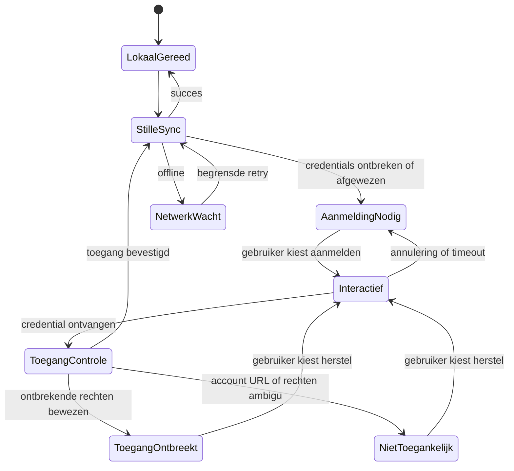
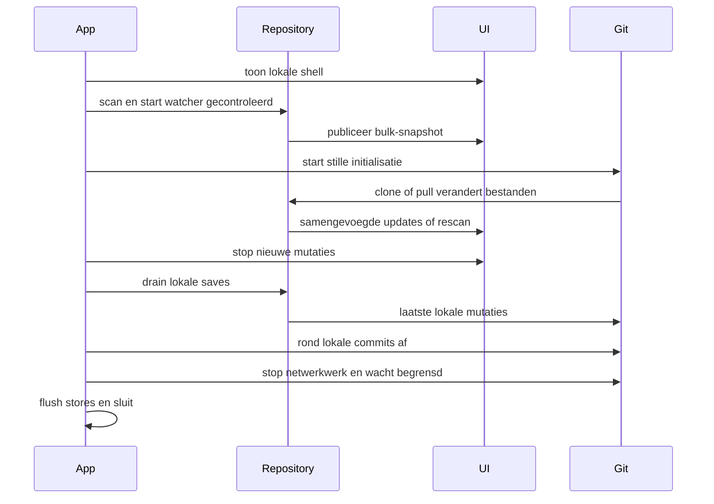

# SnippetLauncher snelheid en betrouwbaarheid - Plan

## Goal Capsule

Joep en andere gebruikers kunnen snel zoeken en typen, lokaal blijven werken wanneer GitHub hapert en hun wijzigingen betrouwbaar bewaren en synchroniseren.
De aanleiding en bewijsvoering staan in [de app-audit](../reviews/2026-10-03-app-audit.md), op broncommit `e795fa1`.
Deze opdracht levert review en planning; implementatie en gebruikersrelease volgen op een afzonderlijke opdracht.

---
## Product Contract

### Requirements

**Snelheid en bediening**

- R1. De lokale zoekfunctie wordt bruikbaar zonder op GitHub-aanmelding of netwerksync te wachten.
- R2. Laden en zoeken blokkeren geen normale tekstinvoer; iedere bulk-load publiceert hoogstens een samengevoegde UI-verversing per afgeronde batch.
- R3. Een late focusactie mag reeds getypte tekst niet selecteren, wissen of een gesloten popup opnieuw activeren.

**Aanmelding en synchronisatie**

- R4. Achtergrondsync opent geen aanmeldvenster; alleen een expliciete herstelactie mag interactief aanmelden.
- R5. Geannuleerde of mislukte autorisatie toont een begrijpelijke toestand en behoudt lokaal gebruik en pending werk.
- R6. Herstelde credentials of netwerktoegang maken handmatige pushretry mogelijk, ook na uitgeputte automatische pogingen.
- R7. Nieuwe lege remotes en bestaande bibliotheken synchroniseren aantoonbaar in beide richtingen.
- R8. Pending syncwerk blijft aan de juiste repository en remote verbonden en is na herstart/corruptie herstelbaar.

**Behoud van werk**

- R9. Externe wijzigingen, selectie, Nieuw en afsluiten wissen geen onopgeslagen editorconcept zonder bewuste keuze.
- R10. Een bibliotheekwissel houdt zoeken, editor, gebruiksstatistieken en sync coherent verbonden aan dezelfde actieve bibliotheek.
- R11. Fouten in bestandsopslag en shutdown laten geen aanroepen onbeperkt wachten en doen geen stil beroep op lege/default hersteldata.
- R12. Geldige sync-intervalwijzigingen gaan direct in; ongeldige waarden worden afgewezen.

### Scope

Corrigeer de auditbevindingen F1-F18 binnen de bestaande WPF/Core/Git-architectuur.
De eerste slag houdt Git Credential Manager als bestaande aanmeldroute.
Een eigen GitHub OAuth/device-flow, Git-afhankelijkheid verwijderen, code-signing, themaherontwerp en silent auto-update zijn vervolgkeuzes buiten deze uitvoering.
Geen credentials in settings of logs; alleen geanonimiseerde diagnostiek en synthetische testinhoud.

---
## Planning Contract

### Key Technical Decisions

- KTD1. Behoud de dedicated Git-worker en single-writer repository; publiceer immutable bibliotheek- en gebruikssnapshots voor readers. Dit voorkomt F9 en maakt R2 haalbaar.
- KTD2. Scheid stille credentialraadpleging van expliciete interactieve aanmelding. GCM wordt uitsluitend per childproces geconfigureerd; verander geen globale Gitconfig. Dit realiseert R4-R5.
- KTD3. Maak credential- en syncfouten getypeerd waar bewijs dat toelaat. Bij een ambigu antwoord is de toestand 'Repository niet toegankelijk: controleer account, URL en rechten'; een 404 of algemene autorisatiefout bewijst geen credentialafwijzing. Controleer lees- en schrijftoegang afzonderlijk. Netwerkfouten en ambigu toegangsverlies mogen nooit opgeslagen credentials verwijderen.
- KTD4. Pas een mapwijziging in de eerste slag pas na herstart toe. Bewaar de huidige bibliotheek actief tot een gecontroleerde afsluiting; laat instellingen duidelijk de pending wijziging tonen. Dit is de kleinste veilige oplossing voor R10.
- KTD5. Behandel Git-geschiedenis, branch-ahead-status en ongecommitte lokale mutaties als herstelbron; de queue is een repo/remotegebonden versneller, geen enige bewijs van pending werk. Dit realiseert R6-R8.
- KTD6. Houd het editorconcept onafhankelijk van lijstselectie en repositorysnapshots, inclusief placeholderwijzigingen. Dit realiseert R9.

### High-Level Technical Design

Onderstaande schema's tonen verantwoordelijkheden; exacte types en signatures worden tijdens implementatie bepaald.

### Assumptions and Dependencies

De echte oorzaak van de eerste autorisatiefout op de betrokken pc is nog onbekend.
De uitvoering begint met versie, Git/GCM-beschikbaarheid, geselecteerd account en read/write-toegang gecontroleerd te reproduceren, zonder tokens of persoonlijke inhoud te verzamelen.
Deze ontbrekende veldinformatie blokkeert niet de bewezen correcties aan retries en timeout.
Als het resultaat een andere authmethode vereist, leg die productkeuze apart voor.

De recente sync-fix is broncode, geen aangetoonde upgrade van geïnstalleerde gebruikers.
Release volgt de bestaande `.claude/skills/release/SKILL.md`, inclusief aparte versiekeuze.

---
## Implementation Units

### U1. Begrensde en herstelbare aanmelding

Covers R1, R4-R5; audit F4-F5. Eerst opleveren zodat automatische prompts stoppen.

**Files:** `src/SnippetLauncher.Core/Sync/GitService.cs`, nieuwe credential/process-abstractions in `Core/Abstractions/`, implementatie in `Core/Sync/`, `src/SnippetLauncher.App/ViewModels/SettingsViewModel.cs`, bijbehorende settings/tray-views.
Volg KTD2-KTD3 en het [Git credentialcontract](https://git-scm.com/docs/git-credential); gebruik [GCM procesinstellingen](https://github.com/git-ecosystem/git-credential-manager/blob/main/docs/environment.md) voor stille achtergrondoperaties.

**Approach:** stdout/stderr en proceswait vallen gezamenlijk onder cancellation/timeout; beëindig de childprocesboom bij afbreken.
Stille operaties falen snel als interactie nodig is en pauzeren auth-retries.
Een herstelklik start hoogstens één aanmelding; test repositorytoegang vóór succesmelding.
Geef de helper repo-context en volledig gevalideerde credentialcontext; approve pas na geverifieerde acceptatie, reject uitsluitend bij geverifieerde credentialafwijzing.
Log nooit input/output met secrets; UI-fouten bevatten geen ruwe credentialdata.
Valideer remote-URLs vóór opslag: wijs ingebedde wachtwoorden/tokens en credentialdragende queryparameters af, redigeer userinfo/querydata in logs en uitzonderingen en behandel bestaande settings veilig bij laden.
Gebruik uitsluitend de geschoonde remote-identiteit voor queues.

**Tests:** nieuwe `tests/SnippetLauncher.Core.Tests/CredentialProviderTests.cs` en uitbreidingen in `GitServiceTests.cs`.
Gecontroleerd helperproces sluit stdout niet: timeout/cancel eindigt proces en call.
Test exitcodefout, ontbrekende helper, verkeerd account, afgewezen token en netwerkfout als afzonderlijke uitkomsten.
Test verkeerde URL, geldig account zonder toegang en read-only account: geen onterechte credentialverwijdering en geen claim van schrijftoegang op basis van een geslaagde fetch.
Een remote-URL met synthetisch token mag nergens ongeredigeerd in settings, queue of logs verschijnen.
Na tien timer-ticks zonder credentials verschijnt nul loginvensters; na één herstelklik maximaal één.
Na annuleren kan lokaal nog opgeslagen worden en blijft de syncqueue intact.
Voer daarnaast een handmatige GCM-proef uit met twee Windowsgebruikers, succesvolle login plus appherstart en een account zonder repositoryrechten.

### U2. Betrouwbaar pushherstel

Covers R6-R8; audit F10-F12, F15. Na U1.

**Files:** `Core/Sync/GitService.cs`, `Core/Sync/PushQueueStore.cs`, `App/App.xaml.cs`; tests `GitServiceTests.cs` en nieuwe `PushQueueStoreTests.cs`.
Volg KTD5.
Handmatige retry opent opnieuw een poging na het automatische limiet; behoud backoff voor netwerkfouten en authpauze voor loginfouten.
Configureer tracking na eerste succesvolle push of gecontroleerd herstel van een bestaande branch.
Bind queues aan genormaliseerde repository/remote-identiteit; migreer de oude globale queue alleen als ownership aantoonbaar is.
Bij twijfel behoud/quarantaineer entries en leid pending toestand uit de juiste Git-repository af.
Een entry mag alleen verdwijnen als zijn commit aantoonbaar via de gepushte branch op de bedoelde remote bereikbaar is.

**Tests:** echte lege bare remote, eerste save/push, tweede client push en eerste client pull levert nieuwe inhoud op.
Vijf gefaalde attempts gevolgd door een gezonde remote en handmatige retry slaagt.
Pending entry uit repo A blijft bestaan na succesvolle push in B.
Corrupte/ontbrekende queue plus ahead-commit wordt herkend en gepusht zonder extra snippetedit.
Non-fast-forward behoudt lokaal werk en biedt pull/merge/herstel; geen force-push.
Bij mislukte eerste clone met later lokaal opgeslagen werk: herstel via een aparte clone en gecontroleerde import met conflictkeuze; overschrijf de lokale bibliotheek niet en force-push niet.
Regressie: geweigerde eerste clone → lokale snippet opslaan → aanmelding herstellen → lokale en remote-snippets beide behouden → tweerichtingssync slaagt.

### U3. Sneller laden, zoeken en focussen

Covers R1-R3; audit F1-F3, F9 en scan/clone-race. Na stabiele reader-snapshots, vóór workerqueries.

**Files:** `Core/Storage/SnippetRepository.cs`, `Core/Search/SearchService.cs`, `App/ViewModels/EditorViewModel.cs`, `App/ViewModels/SearchPopupViewModel.cs`, `App/Views/SearchPopupWindow.xaml.cs`, `App/App.xaml.cs`.
Behoud aparte semantiek voor lokale edits en reloads, zodat bulk-notificaties niet onbedoeld N Git-commits starten.
Publiceer een bulk-snapshot; bouw editorlijst bij gebruik op en verwerk losse wijzigingen samen/incrementieel.
Bereid zoekvelden voor; zoek buiten de dispatcher en publiceer uitsluitend het nieuwste queryresultaat.
Een oude berekening of callback mag een nieuwe query/openingscyclus niet wijzigen.
Bind resultaten en bevestiging aan dezelfde querygeneratie; Enter wacht op actuele resultaten of is met zichtbare zoekstatus tijdelijk geblokkeerd.
Regel load/watcher/clone-volgorde of een gegarandeerde rescan zodat nieuwe clonebestanden nooit buiten de scan vallen.

**Tests:** uitbreidingen `SnippetRepositoryTests.cs` en `SearchServiceTests.cs`, synthetische bibliotheken 0/100/1000/5000.
Bulk-load levert volledig snapshot met begrensd notificatieaantal; gelijktijdig lezen/schrijven geeft geen exception of half snapshot.
Een langzame query A na snelle query B mag B niet vervangen.
Query A → query B → onmiddellijk Enter mag geen resultaat van A kiezen; hetzelfde geldt voor snel heropenen met oude resultaten.
Eerste clone tijdens lokale scan levert na gereed alle snippets op, zonder appherstart.
WPF-proef: onmiddellijk typen na hotkey, Escape vóór focusretry, snel heropenen en typen tijdens sync; tekst blijft intact.

### U4. Bescherm editorconcepten en bibliotheekkeuze

Covers R9-R10; audit F6-F8. Sluit aan op U3.

**Files:** `App/ViewModels/EditorViewModel.cs`, `PlaceholderRowViewModel.cs`, `SettingsViewModel.cs`, `App/Views/EditorWindow.xaml.cs`, `App/App.xaml.cs`.
Volg KTD4 en KTD6.
Bewaar conceptinhoud bij externe snapshotupdates en bied een duidelijke keuze bij bronconflict.
Vraag bewaren/verwerpen/annuleren bij selectie, Nieuw, Quick Add en afsluiten wanneer werk verloren zou gaan.
Een verborgen editor kan het concept behouden; procesafsluiten moet wel worden beschermd.
Placeholderrijen en body-only nieuwe concepten tellen als dirty.
Mapinstellingen onderscheiden actieve en pending map; alle consumers blijven tot herstart dezelfde actieve repository gebruiken.
Bewaar pending pad afzonderlijk van de actieve runtime-config, zodat een latere remote- of timerwijziging niet voortijdig diensten op de nieuwe map bouwt.

**Tests:** bestaande Core-tests waar relevant plus gecontroleerde WPF-gedragsproeven volgens de projectconventie.
Concept in A blijft behouden bij externe wijzigingen aan A en B en bij handmatige sync.
Wijzigen van alleen placeholderwaarde zet dirty.
Map A naar B instellen laat huidige saves in A landen met duidelijke herstartmelding; na gecontroleerde herstart werken zoeken, save, usage en sync in B.
Annuleren van een verliesgevaarlijke actie behoudt alle velden.

### U5. Worker-lifecycle en duurzame stores

Covers R8, R11-R12; audit F13-F18. Foundation voor veilige integratie; deel opslagherstel met U2.

**Files:** `Core/Storage/SnippetRepository.cs`, `UsageStore.cs`, `Core/Sync/GitService.cs`, `PushQueueStore.cs`, `Core/Settings/SettingsService.cs`, `App/App.xaml.cs`, `SettingsViewModel.cs`.
Subscriptions worden expliciet verwijderd; oude worker/proces eindigt voordat een opvolger dezelfde repository opent.
Channelweigering geeft direct failure; geaccepteerde opdrachten eindigen met result/failure/cancel.
Drain lokale saves bij afsluiten en houd network shutdown begrensd; bewaar ongepubliceerde commits.
Stop eerst nieuwe UI-mutaties, drain repositorysaves en rond de daardoor ontstane lokale Git-commits af; stop pas daarna Git/netwerkwerk.
Herken bij startup ook ongecommitte snippetwijzigingen van een onderbroken afsluiting en voer die gecontroleerd naar commit/sync.
UsageStore is eigendom van de host, niet van elke repository afzonderlijk.
Schrijf JSON via atomair vervangen, behoud hersteldata en log corruptie met geredigeerde diagnose.
Usageflush werkt op snapshots met versiecontrole en vangt I/O-fouten af.
Externe file-op fouten laten de repositoryworker doorwerken of beëindigen expliciet alle pending opdrachten.
Valideer sync-interval op een gedocumenteerd positief bereik en pas de timer live aan.

**Tests:** nieuwe `UsageStoreTests.cs`, `SettingsServiceTests.cs`; uitbreidingen repository/Git/queue-tests.
Shutdown tijdens save rondt die save af of rapporteert expliciet failure; tijdens offline push blijven commits herstelbaar.
Laatste save → shutdown → restart zonder extra edit publiceert die wijziging alsnog naar de juiste remote.
Een helper die wacht wordt geannuleerd en laat geen tweede writer achter bij serviceswitch.
Calls op gesloten channels falen binnen begrensde tijd.
Een extern onleesbaar bestand blokkeert een volgende gezonde save niet.
Flush tijdens RecordUse, volle/schrijfgeblokkeerde opslag en corrupt JSON veroorzaken geen procescrash of stil verlies van hersteldata.
Nul/negatief interval wordt geweigerd; geldige wijziging wordt live waarneembaar.

### U6. Veldproef en documentatie

Covers R1-R12; na U1-U5.

**Files:** `docs/architecture.md`, `docs/runbooks/sync-stuck.md`, `docs/setup-second-user.md`, `docs/setup-new-user.md`, nieuwe meetrapportage onder `docs/reviews/`.
Werk documentatie bij op basis van geverifieerd gedrag, inclusief zoekindex, herstel en pending mapwijziging.
Voer installerdistributie pas uit na afzonderlijke versiekeuze en volgens de release-skill.

**Verification:** twee Windowsgebruikers en twee clients op dezelfde testrepository.
Test offline starten, cold/warm start, eerste clone, login annuleren, toegang geweigerd, restart na succesvolle login, editconflict en netwerkherstel.
Gebruik uitsluitend synthetische snippets; rapporteer aantallen, versie, machineprofiel, meetmethode en verschillen met baseline.

---
## Verification Contract

| Gate | Units | Bewijs |
|---|---|---|
| `dotnet build Snippets.sln -c Release` | alle | Release-build slaagt |
| `dotnet test Snippets.sln -c Release` | alle | Core- en architectuurtests groen |
| `dotnet format Snippets.sln --verify-no-changes --severity warn` | alle | Geen formatwaarschuwingen |
| Bestaande Core coverage-poort | alle | Minimaal 70%; gerichte nieuwe regressies aanwezig |
| WPF-handproef in geïsoleerde bronapp | U3-U5 | Invoer, focus, dirty guards en mapinstellingen bewezen |
| Echte GCM/private testrepo-proef | U1-U2, U6 | Geen achtergrondprompts, login houdt stand na herstart, correcte toegangsfout |
| Performanceproef | U3, U6 | Baseline en verbeterde meetreeksen op dezelfde machine |

Meet processtart → tray, lokale repository gereed, popup → focus, eerste tekenverwerking, query → resultaten en dispatcherwachttijd afzonderlijk.
Vergelijk cold/warm start en bibliotheken 0/100/1000/5000, offline en met vertraagde login.
Voorgestelde acceptatiebudgetten op de vooraf beschreven referentiemachine: warm popup → typen p95 <=150 ms en query → actuele resultaten p95 <=200 ms bij 1000 snippets.
Dit zijn doelen, geen gemeten huidige waarden of garanties voor iedere pc.
Laat bij elke reeks aantallen herbouwacties zien; bulk-load mag geen volledige lijstherbouw per bestand meer veroorzaken.
Bij onhaalbare budgetten leg de gemeten bottleneck voor; verruim doelen niet stil.

---
## Definition of Done

Alle R1-R12 zijn bewezen met bovenstaande scenario's en poorten.
Geen onbewezen claim dat de persoonlijke loginlus opgelost is: bevestig de daadwerkelijke oorzaak en succesvolle herstelproef afzonderlijk.
Lokale snippets en ahead-commits blijven behouden bij netwerk-, auth- en shutdownfouten.
Onafhankelijke branchreview op security, architecture, performance en simplicity vóór PR volgens projectconventie.
Lever beheersbare PR's per unit of samenhangende groep op; repository- en readerfoundations moeten vóór afhankelijk achtergrondwerk landen.
Een gebruikersrelease vereist daarna expliciete versiekeuze en verificatie van de daadwerkelijk geïnstalleerde binary.

## Uitvoering 2026-10-03

U1-U5 geïmplementeerd; U6 documentatie, Core-baselinevergelijking en WPF-scenario's uitgevoerd. Volledige lokale tests: 146 Core + 1 architectuur groen, 87.77% Core-dekking, 19 WPF-scenario's groen. Vier reviewbevindingen gecorrigeerd en onafhankelijk gehercontroleerd. Zie [uitvoeringsrapport](../reviews/2026-10-03-startup-login-uitvoering.md).

Joep heeft de echte Yasmina/GCM-proef expliciet doorgeschoven (“Nee, die proef kan later”). Volledige cold/warm processtart en fysieke hotkey/invoer blijven eveneens veldacceptatie; gemeten Core-tijden zijn geen volledige UI-latentieclaim. Een gebruikersinstaller volgt pas na afzonderlijke versiekeuze volgens CLAUDE.md; huidige tag v1.1.0.

## Sessieafsluiting 2026-10-04

Code gemerged via PR #2. Release v1.1.1 gepubliceerd met installer, zip en SHA256-controlesommen; remote assetdigests zijn gelijk aan lokale hashes. Joep heeft de installer uitgevoerd. Technische uitvoering en release zijn afgerond; praktijkacceptatie blijft open en staat in [de handoff](../handoffs/2026-10-04-snippets-praktijkacceptatie.md).

